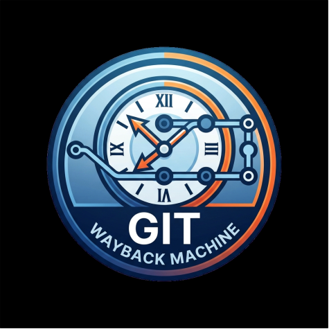

<p align="center">
  
</p>

# Git Wayback Machine 🧭

> **Stop wondering "Why is this code like this?" and start *seeing* it.**

Git Wayback Machine is a powerful VSCode extension that transforms your dry Git history into a rich, interactive narrative. Visualize file evolution, understand ownership patterns, and replay changes like a cinematic time machine.

## ✨ Key Features

- **🎞️ Interactive History Replay**: Step through your code's evolution commit-by-commit. Watch the file build itself with line-by-line typing animations and high-contrast change highlighting.
- **🕒 Vertical Timeline**: A beautiful, interactive sidebar listing all commits for the active file. Filter by author and jump to any point in time instantly.
- **📊 Insights Engine**: Automatically calculates a **Stability Score** (0-100%) for your file based on churn and contributor diversity.
- **📖 Story Mode**: Generates a human-readable "biography" of your file, detailing its birth, major transformations, and current state.
- **🔥 Heatmap & Blame**: Integrated author attribution with color-coded "age" indicators. See at a glance which parts of your code are stable and which are "hot" with recent changes.
- **📂 Sidebar Integration**: Deep integration with the VSCode Activity Bar. Access your file history directly from a dedicated sidebar panel.

## 🚀 Getting Started

1.  Open any file within a Git repository in VSCode.
2.  Click the **Git Wayback** icon (your new logo!) in the Activity Bar.
3.  Select a commit from the sidebar to open the **Wayback Timeline**.
4.  Use the playback controls at the bottom of the code viewer to replay the history.

## 🎨 Commands

*   `Git Wayback: Open Timeline` — Launch the main interactive replay and timeline view.

## 🔧 Installation & Development

To run the extension locally for development:

1.  Clone this repository.
2.  Install dependencies:
    ```bash
    npm install
    cd webview && npm install
    ```
3.  Build the project:
    ```bash
    npm run build
    ```
4.  Press **F5** in VSCode to launch a new "Extension Development Host" window.

## 🛠 Tech Stack

*   **Extension Host**: VSCode API, TypeScript, Webpack.
*   **Webview UI**: React 18, Vite, TailwindCSS.
*   **Git Layer**: Native Git CLI integration via `child_process`.
*   **Analytics**: Custom rule-based Insights Engine.

---

**Built for developers who want to understand the *journey* of their code, not just its destination.**
